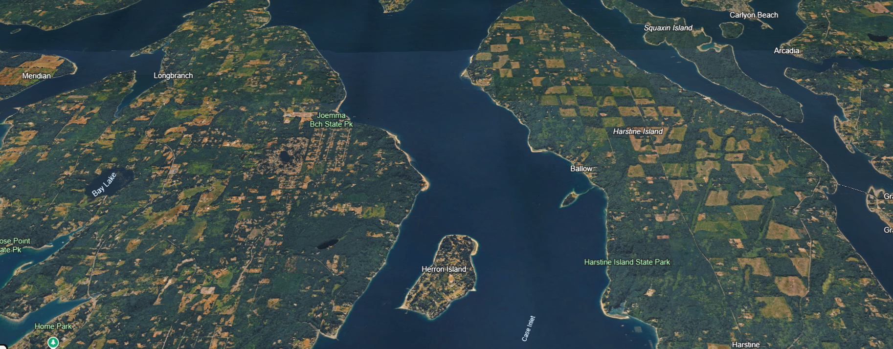
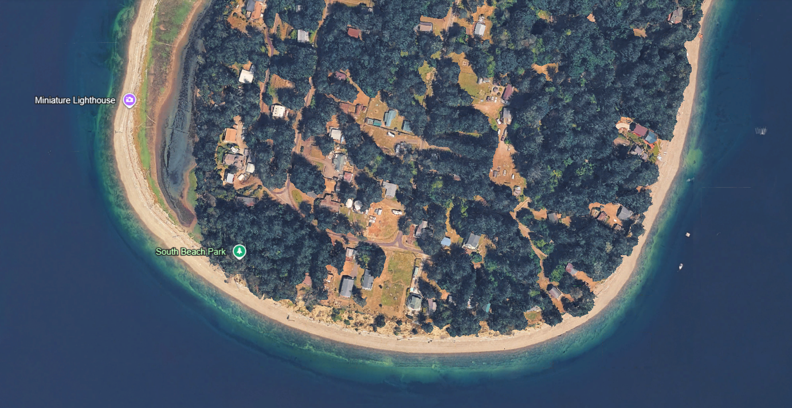
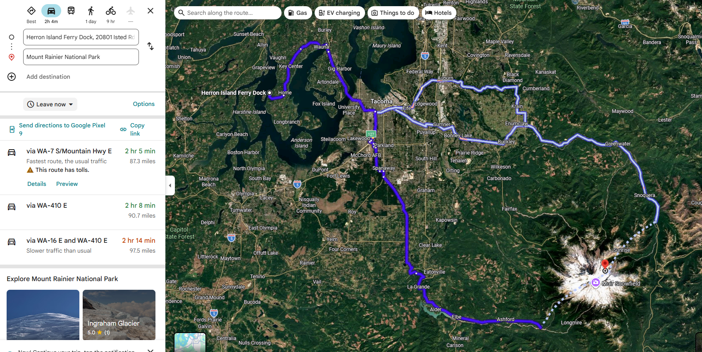
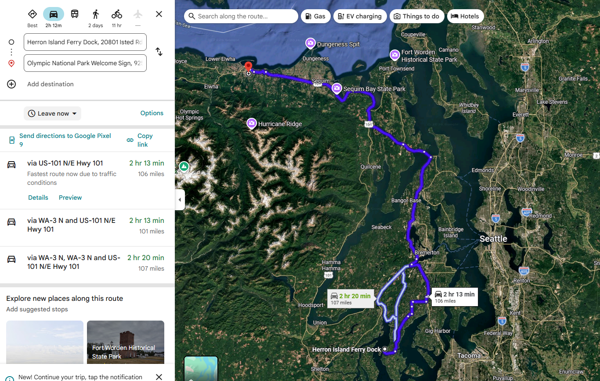

# Eagle Bluff — The Island & Nearby

> **Life on Herron Island** — expectations, beaches, wildlife, things to do. Ferry logistics are in [30-FerryArrivalGuide.md](30-FerryArrivalGuide.md).

See also: [Surrounding Area](11-SurroundingArea.md) · [The Home](13-TheHome.md) · [Welcome Book](10-WelcomeBook.md)

---

## Island Expectations

Herron Island is a **private, residential island** in Puget Sound. Guests come for peace and nature — not resort amenities.

| Expect | Don't expect |
|--------|----------------|
| Quiet neighborhoods | Restaurants, bars, shops |
| Wildlife, beaches, views | Hourly ferry like WSDOT |
| Slower pace | Strong cell coverage everywhere |
| Ferry as part of the adventure | Uber/Lyft on island |

- **Community:** Respect quiet hours (10 PM – 7 AM). This is people's home year-round.
- **Cell service:** Variable — plan accordingly.
- **Supplies:** No grocery store — see [Surrounding Area](11-SurroundingArea.md).

---

## About Herron Island

Private island in **Case Inlet**; access via [HMCHI ferry](https://www.hmchi.org/p/FERRY) only. Residential community with beaches, trails, and wildlife. **Harstine Island** lies to the east; **Joemma Beach** and the Key Peninsula to the north/west.

---

## Beaches & Tide Guide

### South Beach Park

Walkable from Eagle Bluff (moderate walk). Primary beach destination mentioned in listing. Also nearby: **Miniature Lighthouse** on the south shore.

<!-- TODO: Walking time from 22604, trail notes -->

### Beach access & etiquette

<!-- TODO: Other access points, public vs. community norms -->

### Tides

Low tides affect **ferry service** — see [Ferry Schedules](31-FerrySchedules.md). They also affect beach walking and tidepooling.

- Tide reference: **Ballow Station #9446583** (NOAA)
- Apps: Tide Charts (7th Gear), [tidesandcurrents.noaa.gov](https://tidesandcurrents.noaa.gov/)

<!-- TODO: Clamming/crabbing rules if applicable -->

---

## Wildlife Guide

Guests love this. Respect wildlife — do not feed, approach, or disturb animals.

### Bald eagles

<!-- TODO: Nesting areas near bluff, best viewing from property/deck -->

### Orcas

Occasional offshore sightings from the bluff and decks.

<!-- TODO: Seasonality, where to watch, Be Whale Wise guidelines -->

### Deer, seals, otters

Common on and around the island.

<!-- TODO: Specific viewing tips -->

### Wildlife tracking (future)

The Eagle Bluff app will let guests log eagle and orca sightings — contribute to the guest wildlife journal.

---

## Things to Do on the Island

| Activity | Notes |
|----------|-------|
| **South Beach** | Walk from property |
| **Island trails** | Quiet walks, birding |
| **Deck & bluff watching** | Boats, sunsets, wildlife |
| **Fire pit** | Burn ban June–Aug — see [House Rules](20-HouseRules.md) |
| **Bikes** | Provided at property — explore island roads |
| **Kayak / water** | <!-- TODO: launch points, rentals? --> |

### Rainy day

Board games, puzzles, movies at the house — <!-- TODO: inventory list from property -->

---

## Day Trips (Off-Island)

Requires ferry round trip — plan around [schedule + cancellations](31-FerrySchedules.md). Drive times from **mainland ferry dock**.

| Trip | Time · distance | Map |
|------|-----------------|-----|
| **Mt. Rainier National Park** | ~2 hr · 87 mi |  |
| **Olympic National Park** | ~2 hr 13 min · 106 mi |  |
| **Gig Harbor** | ~36 min | See [Surrounding Area](11-SurroundingArea.md) |
| **Tacoma** | ~48 min | See [Surrounding Area](11-SurroundingArea.md) |

---

## Island Map

Satellite views above cover south island beaches and Case Inlet context. Still needed: `property-22604-walk-south-beach.png` — mark up [island-south-beach-lighthouse.png](../assets/maps/island-south-beach-lighthouse.png) on site.

---

## Respect the Island

Pack out what you pack in. Herron Island is a residential community — leave beaches and trails as you found them.
